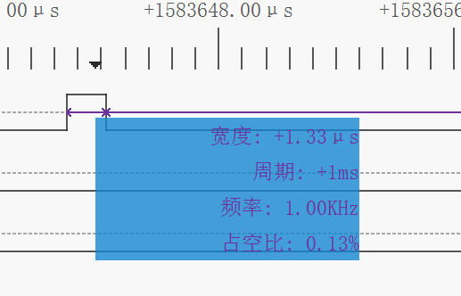
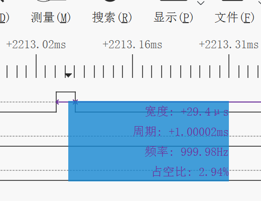

# 达妙H723开发板姿态解算

此惯导姿态解算算法移植于：[WangHongxi2001/RoboMaster-C-Board-INS-Example (github.com)](https://github.com/WangHongxi2001/RoboMaster-C-Board-INS-Example)

具体原理请看上面链接，同时还有开源的Mahony算法作为对比测试,开启了H7的cache作为优化，同时大量使用arm的dsp库进行优化。

主要控制在App/imu_temp_ctrl.c。

## 实际测试

开源Mahony算法-包含四元数转欧拉角的部分为1.33us,不加四元数转欧拉角只需要520ns



开源EKF姿态解算算法-包含四元数转欧拉角的部分，总共为29.4us.



## 注意事项：

1.上电后先进行恒温控制（温度控制我简单的调了一下PID，具体可以打开DEBUG进行设定，不同的电压PID可能稍有差别，需要对PID进行调整），当温度达到设定温度（40°），进行一个计数，当计数值达到阈值（目的是确保温度已经到40度附近）才进行到第二个状态

2.第二个状态，即attitude_flag==1，进行陀螺仪0飘初始化，此过程中需要保持开发板静止。初始化结束后进入第三个状态

3.attitude_flag==2，进行姿态解算

```c
gyro[0]-=gyro_correct[0];   //减去陀螺仪0飘
gyro[1]-=gyro_correct[1];
gyro[2]-=gyro_correct[2];
#if cheat              //作弊 可以让yaw很稳定 去掉比较小的值
	if(fabsf(gyro[2])<0.003f)
	gyro[2]=0;
#endif
				IMU_QuaternionEKF_Update(gyro[0],gyro[1],gyro[2],accel[0],accel[1],accel[2]); 
pitch=Get_Pitch(); //获得pitch
roll=Get_Roll();//获得roll
yaw=Get_Yaw();//获得yaw
```

此代码中，cheat是通过一定的作弊手段，去掉了陀螺仪gyro[2]小的值 从而使得yaw完全静止不太飘，如果应用场景角速度变化不明显建议去掉。

获得陀螺仪的pitch，roll，yaw通过调用函数。

四元数位于QEKF_INS.q 的数组中

### 串口显示曲线

***********************************************************************
默认开了一个线程通过USB CDC进行上位机数据发送。

上位机默认协议使用vofa的justfloat协议。vofa下载链接：[VOFA-Plus上位机 | VOFA-Plus上位机](https://www.vofa.plus/)

虚拟串口为自动波特率可以随意设置，自动识别。

发送的四个口分别为pitch，roll，yaw，temp。temp为陀螺仪温度可以用于调节温度控制PID

```c
***********************************************************************
* @brief      vofa_demo(void)
* @param      NULL 
* @retval     void
* @details:   demo示例
***********************************************************************
**/
void vofa_demo(void) 
{

	// Call the function to store the data in the buffer
	vofa_send_data(0, pitch);
	vofa_send_data(1, roll);
	vofa_send_data(2, yaw);
	vofa_send_data(3, temp);
	// Call the function to send the frame tail
	vofa_sendframetail();
}
```